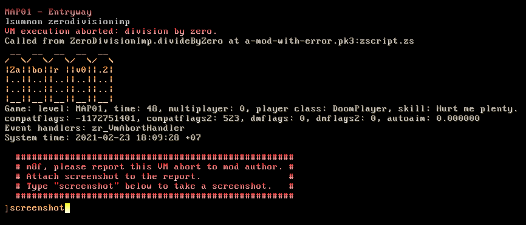

# Zabor

```
 __  __  __  __  __  __
/  \/  \/  \/  \/  \/  \
|Za||bo||r ||v1||.1||.0|
|..||..||..||..||..||..|
|..||..||..||..||..||..|
|__||__||__||__||__||__|
```

Zabor is VM abort handler for GZDoom. It is both a script library and a
standalone add-on.



This add-on is a part of [m8f's doctor's bag](https://mmaulwurff.github.io/pages/doctors-bag).

## Features

When VM abort happens, Zabor prints:
- basic game information: map name, total time, multiplayer status, player
  class, skill;
- game configuration: compat flags, dm flags, autoaim;
- event handler list;
- system time;
- a request for the user to report the VM abort;
- `zr_enabled` cvar to disable Zabor.

If there are several Zabor-based handlers loaded, only the first one will print
stuff. For this to work, all handlers must have "VmAbortHandler" somewhere in
their class name.

Also there is `zabor` console command for gathering a report by manual request.

## How to use

### As a standalone add-on

Simply load zabor-v*.pk3 with other mods. Wait for an abort. You can test that
it works with the following command: `error welp`.

### As a script library

- Copy zr_VmAbortHandler class from zscript.zs to your mod.
- Change `zr_` to something unique. Please make sure that `VmAbortHandler` part
   of the name remains intact.
- Add this event handler to `gameinfo` section in `mapinfo` lump like this:

```
gameinfo
{
  AddEventHandlers = "my_VmAbortHandler"
}
```

- Copy `zabor` alias from `keyconf.txt` if you want `zabor` console command to
  be available.
- Copy `zr_zabor` cvar from `cvarinfo.txt` and change its prefix.


## Acknowledgments

- Thanks to KeksDose for the concept of VM abort handler.
- Thanks to Colerx for bug reports.
- Thanks to Accensus for feature suggestions.
